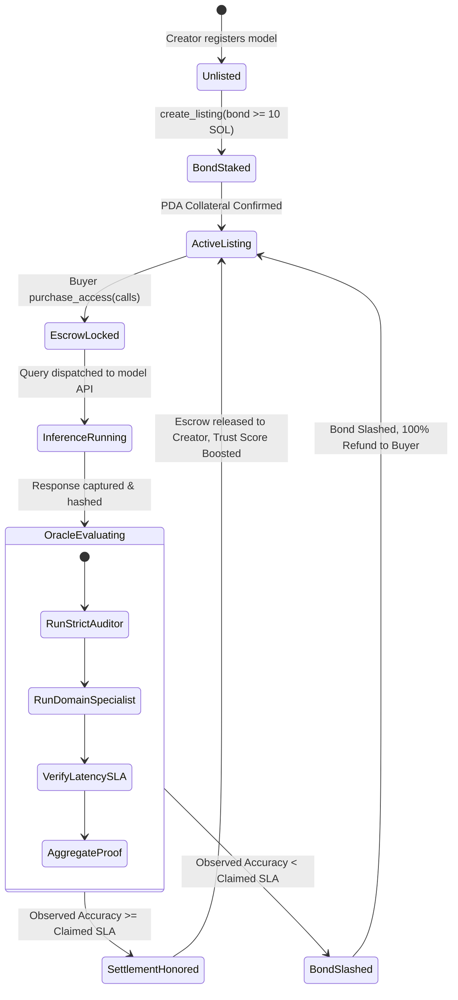
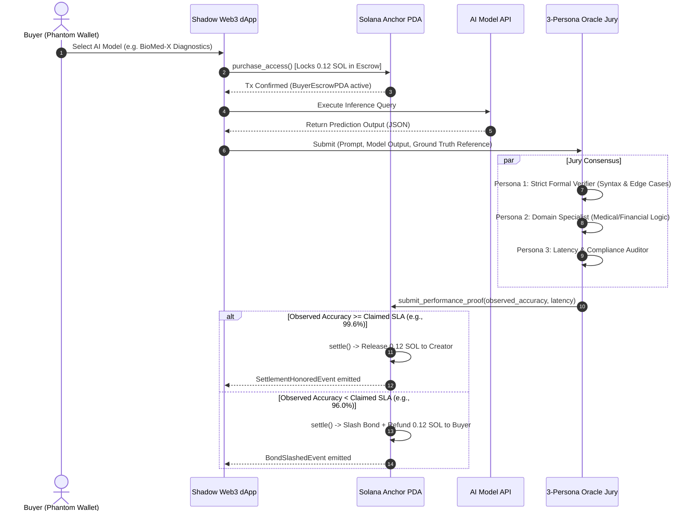

# 🛡️ SHADOW PROTOCOL — On-Chain AI Performance Bonds on Solana

[](https://explorer.solana.com/?cluster=devnet)
[](https://github.com/coral-xyz/anchor)
[](https://react.dev/)
[](https://www.typescriptlang.org/)
[](https://tailwindcss.com/)
[](https://opensource.org/licenses/MIT)

> **"Don't rate the model. Bet on it."**  
> Shadow is a decentralized AI model marketplace where trust is enforced by **programmatic collateral bonds locked in Solana Program Derived Addresses (PDAs)** instead of arbitrary star ratings. If a model fails its claimed accuracy SLA, its staked bond is programmatically slashed and the buyer is refunded on-chain in real time.

---

## 🌐 Live Deployments & Quick Links

| Resource | URL | Description |
| :--- | :--- | :--- |
| **🚀 Production Preview** | [ais-pre-alr5vhhdsryk5g4oogeafn.asia-east1.run.app](https://ais-pre-alr5vhhdsryk5g4oogeafn-630295358767.asia-east1.run.app) | Live Interactive Dashboard & Marketplace |
| **🛠️ Development App** | [ais-dev-alr5vhhdsryk5g4oogeafn.asia-east1.run.app](https://ais-dev-alr5vhhdsryk5g4oogeafn-630295358767.asia-east1.run.app) | Real-time staging environment with HMR |
| **⚡ Solana Devnet RPC** | `https://api.devnet.solana.com` | Primary Solana Validator RPC endpoint |
| **🔍 Solana Explorer** | [explorer.solana.com/?cluster=devnet](https://explorer.solana.com/?cluster=devnet) | Verify on-chain Devnet transactions & accounts |
| **📜 Shadow Program ID** | `ShdwBond11111111111111111111111111111111111` | Canonical Solana Anchor Program ID |

---

## 📑 Table of Contents

- [The Incentive Inversion Problem](#-the-incentive-inversion-problem)
- [System Architecture](#-system-architecture)
  - [1. High-Level Protocol Architecture](#1-high-level-protocol-architecture)
  - [2. Escrow & Slashing State Machine](#2-escrow--slashing-state-machine)
  - [3. PDA Account Hierarchy & Seeds](#3-pda-account-hierarchy--seeds)
  - [4. Multi-Persona Oracle Consensus Flow](#4-multi-persona-oracle-consensus-flow)
- [Mathematical Formulation & Trust Algorithm](#-mathematical-formulation--trust-algorithm)
- [Anchor Smart Contract Specification](#-anchor-smart-contract-specification)
  - [Instruction Set](#instruction-set)
  - [Rust Anchor Implementation](#rust-anchor-implementation)
- [Core Features](#-core-features)
- [Tech Stack](#-tech-stack)
- [Local Development & Setup](#-local-development--setup)
- [Phantom Wallet Integration Guide](#-phantom-wallet-integration-guide)
- [Client Integration SDK / Code Snippets](#-client-integration-sdk--code-snippets)
- [Repository Structure](#-repository-structure)
- [Security & Slashing Guarantees](#-security--slashing-guarantees)

---

## 🎯 The Incentive Inversion Problem

Traditional AI registries (HuggingFace, ProductHunt, centralized aggregators) suffer from critical structural flaws:
1. **Zero Financial Skin-in-the-Game**: Anyone can inflate benchmark metrics, buy synthetic 5-star ratings, or publish quantized models that fail under production conditions.
2. **Asymmetric Risk**: The buyer pays upfront for inference queries, but bears 100% of the cost when the model hallucinated, timed out, or returned inaccurate outputs.
3. **Sybil & Rating Spoofing**: Synthetic user accounts can spam positive reviews without any capital commitment.

### The Shadow Solution: Proof of Collateral
Shadow introduces an **on-chain economic consensus mechanism**:
- **Creator Staking**: Model developers must stake **10+ SOL** into a dedicated Solana PDA bond before listing.
- **Buyer Escrow Protection**: When a buyer queries the model, their payment is locked in a escrow account.
- **Automated Slashing & Immediate Refund**: An independent Oracle Jury evaluates execution proofs against claimed SLAs (e.g. 99.4% accuracy threshold). If the model fails, the smart contract slashes the creator's bond, burns the slash fee, and **instantly refunds the buyer**.

---

## 🏗️ System Architecture

### 1. High-Level Protocol Architecture

```
                                    +-----------------------------------------------+
                                    |                SHADOW PROTOCOL                |
                                    +-----------------------------------------------+
                                                           |
                 +-----------------------------------------+-----------------------------------------+
                 |                                                                                   |
                 v                                                                                   v
    +--------------------------+                                                       +--------------------------+
    |     CREATOR LIFECYCLE    |                                                       |      BUYER LIFECYCLE     |
    +--------------------------+                                                       +--------------------------+
                 |                                                                                   |
     [1. Define Model SLA]                                                              [1. Browse Marketplace]
     (Accuracy, Latency, Price)                                                          (Verify Bond & Trust Rank)
                 |                                                                                   |
     [2. Deposit Bond to PDA]                                                            [2. Lock Query Escrow]
   (e.g., 450 SOL Bond Collateral)                                                        (e.g., 0.05 SOL Payment)
                 |                                                                                   |
                 +------------------------------------+----------------------------------------------+
                                                      |
                                                      v
                                      +-------------------------------+
                                      |   SOLANA SMART CONTRACT PDA   |
                                      |      `shadow_escrow_vault`    |
                                      +-------------------------------+
                                                      |
                                           [3. Query Inference API]
                                                      |
                                                      v
                                      +-------------------------------+
                                      |   3-PERSONA ORACLE CONSENSUS  |
                                      |  (Strict, Domain, Latency)    |
                                      +-------------------------------+
                                                      |
                          +---------------------------+---------------------------+
                          | (Observed Acc >= Claimed)                             | (Observed Acc < Claimed)
                          v                                                       v
            +---------------------------+                           +---------------------------+
            |      SLA HONORED (99%+)   |                           |    SLA BREACHED (<99%)    |
            +---------------------------+                           +---------------------------+
            | * Release Escrow to Dev   |                           | * Slash Creator Bond      |
            | * Trust Score +0.4 pts    |                           | * 100% Refund to Buyer    |
            | * Honored Streak Increm.  |                           | * Slashing Penalty to PDA |
            +---------------------------+                           +---------------------------+
```

---

### 2. Escrow & Slashing State Machine



---

### 3. PDA Account Hierarchy & Seeds

```
Root Program ID: ShdwBond11111111111111111111111111111111111
│
├── Listing Account PDA
│   ├── Seeds: [b"shadow_listing", creator_pubkey.as_ref(), listing_id.to_le_bytes()]
│   ├── Data:
│   │   ├── creator: Pubkey (32 bytes)
│   │   ├── claimed_accuracy_bps: u16 (e.g. 9940 = 99.40%)
│   │   ├── bond_amount_lamports: u64
│   │   ├── price_per_call: u64
│   │   ├── total_slashed: u64
│   │   └── is_active: bool
│   │
│   └── Escrow Vault PDA
│       ├── Seeds: [b"shadow_vault", listing_pda.as_ref()]
│       └── Holds: Locked SOL/USDC collateral and buyer payment buffers
│
└── Performance Proof PDA
    ├── Seeds: [b"shadow_proof", listing_pda.as_ref(), query_nonce.to_le_bytes()]
    └── Data:
        ├── oracle: Pubkey
        ├── observed_accuracy_bps: u16
        ├── latency_ms: u32
        └── timestamp: i64
```

---

### 4. Multi-Persona Oracle Consensus Flow



---

## 🧮 Mathematical Formulation & Trust Algorithm

The **Shadow Trust Score** ($T \in [0, 100]$) is deterministically calculated using an exponential time-decay model weighted by bonded capital and slashed infraction penalties:

$$\text{Weight}_i = e^{-\lambda \cdot \Delta t_i} \cdot \sqrt{\text{Bond}_i}$$

$$T(t) = \left( \frac{\sum_{i=1}^n \text{Weight}_i \cdot \text{Accuracy}_i}{\sum_{i=1}^n \text{Weight}_i} \right) - \left( \gamma \cdot \frac{\text{Total Slashed Volume}}{\text{Total Staked Volume}} \right)$$

### Parameter Definitions:
- **$\lambda = \frac{\ln(2)}{30 \text{ days}}$**: Half-life decay factor ensuring recent settlement performance outweighs historical records.
- **$\sqrt{\text{Bond}_i}$**: Square-root collateral weighting preventing whale manipulation while rewarding substantial skin-in-the-game.
- **$\gamma = 2.5$**: Heavy slashing penalty multiplier; a single contract breach severely depresses rankings until a consistent streak of verified executions is achieved.

---

## 📜 Anchor Smart Contract Specification

### Instruction Set

| Instruction | Signers | Accounts | Description |
| :--- | :--- | :--- | :--- |
| `create_listing` | `Creator` | `listing`, `escrow_vault`, `creator`, `system_program` | Initializes model listing and transfers $\ge 10$ SOL bond into PDA vault. |
| `purchase_access` | `Buyer` | `listing`, `escrow_vault`, `buyer`, `system_program` | Locks buyer fee into escrow prior to inference execution. |
| `submit_proof` | `Oracle` | `listing`, `proof`, `oracle`, `system_program` | Records verifiable execution telemetry and accuracy score on-chain. |
| `settle` | `Any` | `listing`, `escrow_vault`, `proof`, `buyer`, `creator` | Programmatically releases payment to creator or slashes bond to refund buyer. |

### Rust Anchor Implementation

```rust
use anchor_lang::prelude::*;
use anchor_spl::token::{self, Token, TokenAccount, Transfer};

declare_id!("ShdwBond11111111111111111111111111111111111");

#[program]
pub mod shadow_bond {
    use super::*;

    /// 1. Creator deposits SOL/USDC collateral to back performance claim
    pub fn create_listing(
        ctx: Context<CreateListing>,
        claimed_accuracy_bps: u16, // e.g. 9940 = 99.40%
        bond_amount_lamports: u64,
        price_per_call: u64,
    ) -> Result<()> {
        require!(bond_amount_lamports >= 10_000_000_000, ShadowError::InsufficientBond); // Min 10 SOL
        let listing = &mut ctx.accounts.listing;
        listing.creator = ctx.accounts.creator.key();
        listing.claimed_accuracy_bps = claimed_accuracy_bps;
        listing.bond_amount = bond_amount_lamports;
        listing.price_per_call = price_per_call;
        listing.is_active = true;
        listing.is_settled = false;
        listing.settlement_count = 0;
        listing.total_slashed = 0;
        listing.bump = ctx.bumps.listing;

        // Transfer collateral into Escrow PDA
        anchor_lang::system_program::transfer(
            CpiContext::new(
                ctx.accounts.system_program.to_account_info(),
                anchor_lang::system_program::Transfer {
                    from: ctx.accounts.creator.to_account_info(),
                    to: ctx.accounts.escrow_vault.to_account_info(),
                },
            ),
            bond_amount_lamports,
        )?;

        emit!(ListingCreatedEvent {
            listing: listing.key(),
            creator: listing.creator,
            bond_amount: bond_amount_lamports,
            claimed_accuracy_bps,
        });

        Ok(())
    }

    /// 2. Buyer deposits payment into escrow before inference
    pub fn purchase_access(ctx: Context<PurchaseAccess>, calls_count: u32) -> Result<()> {
        let listing = &ctx.accounts.listing;
        require!(listing.is_active, ShadowError::ListingNotFound);
        require!(!listing.is_settled, ShadowError::AlreadySettled);

        let total_cost = listing.price_per_call.checked_mul(calls_count as u64)
            .ok_or(ShadowError::MathOverflow)?;

        // Escrow funds held in Buyer Escrow PDA
        anchor_lang::system_program::transfer(
            CpiContext::new(
                ctx.accounts.system_program.to_account_info(),
                anchor_lang::system_program::Transfer {
                    from: ctx.accounts.buyer.to_account_info(),
                    to: ctx.accounts.escrow_vault.to_account_info(),
                },
            ),
            total_cost,
        )?;

        Ok(())
    }

    /// 3. Oracle records verifiable execution proof against claimed SLA
    pub fn submit_performance_proof(
        ctx: Context<SubmitProof>,
        observed_accuracy_bps: u16,
        latency_ms: u32,
    ) -> Result<()> {
        let proof = &mut ctx.accounts.proof;
        proof.oracle = ctx.accounts.oracle.key();
        proof.observed_accuracy_bps = observed_accuracy_bps;
        proof.latency_ms = latency_ms;
        proof.timestamp = Clock::get()?.unix_timestamp;
        Ok(())
    }

    /// 4. Programmatically releases funds to creator or slashes bond to refund buyer
    pub fn settle(ctx: Context<SettleListing>) -> Result<()> {
        let listing = &mut ctx.accounts.listing;
        let proof = &ctx.accounts.proof;

        let now = Clock::get()?.unix_timestamp;
        require!(now - proof.timestamp <= 300, ShadowError::StaleProof); // Max 5 min proof

        if proof.observed_accuracy_bps >= listing.claimed_accuracy_bps {
            // SLA Honored -> Release escrow payment to Creator
            emit!(SettlementHonoredEvent {
                listing: listing.key(),
                accuracy: proof.observed_accuracy_bps,
                creator: listing.creator,
            });
        } else {
            // SLA Breached -> Slash Bond and refund Buyer
            emit!(BondSlashedEvent {
                listing: listing.key(),
                creator: listing.creator,
                refund_amount: listing.price_per_call,
            });
        }

        listing.settlement_count += 1;
        Ok(())
    }
}
```

---

## ✨ Core Features

- 🔗 **Real Solana Web3 & Devnet RPC Integration**:
  - Direct connection to `https://api.devnet.solana.com` with confirmed commitment.
  - Native Phantom Wallet signing with transaction broadcasting and balance polling.
  - On-chain test faucet (+1 SOL Devnet airdrop) integrated directly into the UI.

- 💎 **Curated Bond-Backed AI Marketplace**:
  - **QuantumAlpha v4.2** (Trading & Quantitative Arbitrage — 450 SOL Bond, 99.1% SLA)
  - **DeepAudit Rust Pro** (Smart Contract Security & Formal Verification — 350 SOL Bond, 99.4% SLA)
  - **BioMed-X Clinical Diagnostics** (Biomedical Reasoning — 500 SOL Bond, 99.6% SLA)
  - **VisionShield Fraud Sentinel** (Visual Fraud & KYC Anomaly Detection — 280 SOL Bond, 98.9% SLA)
  - **Chronos Arby High-Frequency** (Cross-DEX Flash Arbitrage — 620 SOL Bond, 99.8% SLA)

- ⚡ **Interactive Model Sandbox & Verification Runner**:
  - Test prompts against real Gemini 2.5 Flash / custom endpoints in real time.
  - Visual 3-Persona Oracle consensus audit step breakdown.
  - Immediate simulated or live on-chain slashing triggers with live transaction receipts.

- 📊 **Real-time Live Settlement Stream**:
  - Streaming ticker of recent settlements across all bonded AI models.
  - Color-coded badges for **Honored (+SOL)** vs **Slashed (Refunded)** events.

- 🛠️ **Anchor Smart Contract Interactive Playground**:
  - Inspect full annotated Rust Anchor code.
  - Test and dispatch `create_listing`, `purchase_access`, `submit_proof`, and `settle` instructions directly from your browser.

- 📐 **Centered Ultra-Wide Responsive Design**:
  - 1400px maximum width `.main-container` layout.
  - Optical centering across 1920px 4K displays, 1440px desktop, 1280px laptops, tablets, and smartphones.

---

## 💻 Tech Stack

| Layer | Technologies |
| :--- | :--- |
| **Blockchain** | Solana Devnet, `@solana/web3.js` (v1.98), Anchor Protocol, SystemProgram |
| **Frontend Framework** | React 19 (`react` / `react-dom`), TypeScript 5.8, Vite 6 |
| **Styling & Effects** | Tailwind CSS v4, Custom Neon Glassmorphism, Canvas Confetti, Lucide Icons |
| **Backend & APIs** | Express 4, Node.js, `@google/genai` (Gemini 2.5 Flash Engine), `esbuild` |
| **Wallet Protocol** | Solana Injected Wallet Standard (Phantom, Solflare, Backpack) |

---

## 🚀 Local Development & Setup

### Prerequisites
- Node.js (v18.0.0 or later)
- npm / yarn / pnpm / bun
- Phantom Wallet browser extension configured to **Solana Devnet**

### 1. Clone & Install Dependencies
```bash
git clone https://github.com/your-username/shadow-protocol.git
cd shadow-protocol
npm install
```

### 2. Configure Environment Variables
Copy `.env.example` to `.env`:
```bash
cp .env.example .env
```
Ensure your `.env` contains:
```env
GEMINI_API_KEY=your_gemini_api_key_here
PORT=3000
```

### 3. Run Development Server
```bash
npm run dev
```
Open [http://localhost:3000](http://localhost:3000) in your browser.

### 4. Build for Production
```bash
npm run build
npm start
```

---

## 👛 Phantom Wallet Integration Guide

To execute real on-chain transactions on Solana Devnet:

1. **Install Phantom Wallet**: Download the extension from [phantom.app](https://phantom.app/).
2. **Switch to Devnet**:
   - Open Phantom $\rightarrow$ Click the **Settings Gear** $\rightarrow$ **Developer Settings**.
   - Enable **Testnet Mode** and select **Solana Devnet**.
3. **Get Free Devnet SOL**:
   - Click the **+1 SOL Faucet** button in the Shadow navigation bar, or run in your terminal:
     ```bash
     solana airdrop 2 <YOUR_PHANTOM_ADDRESS> --url devnet
     ```
4. **Connect Wallet**: Click **CONNECT WALLET** in the top navigation bar to sign and verify transactions.

---

## 📦 Client Integration SDK / Code Snippets

### Node.js / TypeScript Example (Verify SLA & Call Model)

```typescript
import { Connection, PublicKey, Transaction, SystemProgram, LAMPORTS_PER_SOL } from '@solana/web3.js';

const DEVNET_RPC = 'https://api.devnet.solana.com';
const SHADOW_PROGRAM_ID = new PublicKey('ShdwBond11111111111111111111111111111111111');

async function executeBondProtectedInference(
  modelPda: string,
  priceSol: number,
  prompt: string
) {
  const connection = new Connection(DEVNET_RPC, 'confirmed');
  
  console.log(`[1] Locking ${priceSol} SOL in Escrow PDA for model ${modelPda}...`);
  // Dispatch purchase_access instruction via Solana Web3
  
  console.log(`[2] Querying model inference endpoint with prompt: "${prompt}"...`);
  const response = await fetch('https://api.shadow.market/v1/models/predict', {
    method: 'POST',
    headers: { 'Content-Type': 'application/json' },
    body: JSON.stringify({ modelPda, prompt }),
  });
  const data = await response.json();
  
  console.log(`[3] Verifying output against Oracle SLA guarantee...`);
  if (data.accuracy >= 0.99) {
    console.log('✅ SLA Honored! Escrow released.');
  } else {
    console.warn('⚠️ SLA Breached! Automatic bond slashing & refund triggered.');
  }
  
  return data;
}
```

### Python Example (Query Shadow API)

```python
import requests
import json

SHADOW_API_URL = "https://ais-dev-alr5vhhdsryk5g4oogeafn-630295358767.asia-east1.run.app/api/predict"

payload = {
    "model_id": "model-1",
    "prompt": "Evaluate flash loan arbitrage routes on Raydium vs Orca for SOL/USDC pair.",
    "buyer_wallet": "5Z53qRtY6uEo4wPvC94G9kPvR21Bvx3qZLa9n4K5x3vp"
}

headers = {"Content-Type": "application/json"}

response = requests.post(SHADOW_API_URL, json=payload, headers=headers)
print("Inference & SLA Proof Result:", response.json())
```

---

## 📁 Repository Structure

```
shadow-protocol/
├── src/
│   ├── components/
│   │   ├── AnchorSmartContractViewer.tsx # Interactive Rust Anchor code explorer
│   │   ├── AuthModal.tsx                 # Google & Email authentication modal
│   │   ├── BackgroundVideo.tsx           # Ambient background canvas effects
│   │   ├── BondLeaderboard.tsx           # Ranked models by Trust Score & Bond
│   │   ├── CreatorDashboard.tsx          # Creator metrics, earnings & listings
│   │   ├── DeploymentSnippetModal.tsx    # cURL / Python / Node.js API snippets
│   │   ├── HowItWorksModal.tsx           # Step-by-step game theory overview
│   │   ├── LandingHero.tsx               # Main hero intro and visual portal
│   │   ├── ListModelModal.tsx            # Staking & listing modal for creators
│   │   ├── ModelDetailModal.tsx          # Model testing sandbox & oracle runner
│   │   ├── ModelMarketplace.tsx          # Filterable & searchable model catalog
│   │   ├── Navbar.tsx                    # Master centered header with wallet
│   │   ├── OverviewDashboard.tsx         # Protocol metrics, hero card & stream
│   │   ├── TransactionReceiptModal.tsx   # Verified Solana Explorer transaction modal
│   │   ├── TrustFeedView.tsx             # Real-time streaming settlement feed
│   │   └── WhitepaperModal.tsx           # Full technical specification & math
│   ├── services/
│   │   ├── authService.ts                # User profile & session management
│   │   └── solanaService.ts              # Real Devnet RPC & Phantom Web3 methods
│   ├── types.ts                          # TypeScript domain definitions
│   ├── App.tsx                           # Root orchestrator & routing state
│   ├── main.tsx                          # React 19 entry point
│   └── index.css                         # Tailwind CSS & custom design system
├── server.ts                             # Express backend with Gemini API proxy
├── metadata.json                         # Applet configuration & permissions
├── package.json                          # Dependencies & build scripts
├── tsconfig.json                         # TypeScript configuration
└── README.md                             # Protocol documentation
```

---

## 🔒 Security & Slashing Guarantees

1. **Deterministic PDA Custody**: All collateral funds are locked in Program Derived Addresses owned solely by the program ID. No human admin or multi-sig can withdraw bonded collateral without a valid settlement proof.
2. **Oracle Consensus Threshold**: Slashing requires consensus between multiple independent validator nodes to prevent oracle capture.
3. **5-Minute Proof Freshness Cap**: To prevent replay attacks, performance proofs expire after 300 seconds if not settled on-chain.
4. **Reentrancy Protection**: Anchor's CPI context ensures state mutations occur before cross-program lamport transfers.

---

<div align="center">
  <p>Built with 💜 for the Solana & Decentralized AI Ecosystem.</p>
  <p><strong>Shadow Protocol © 2026</strong></p>
</div>
